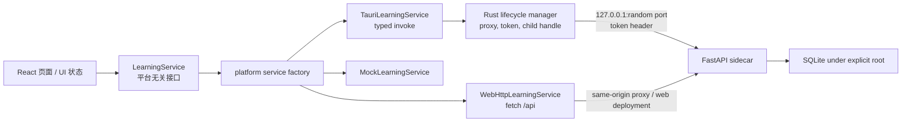
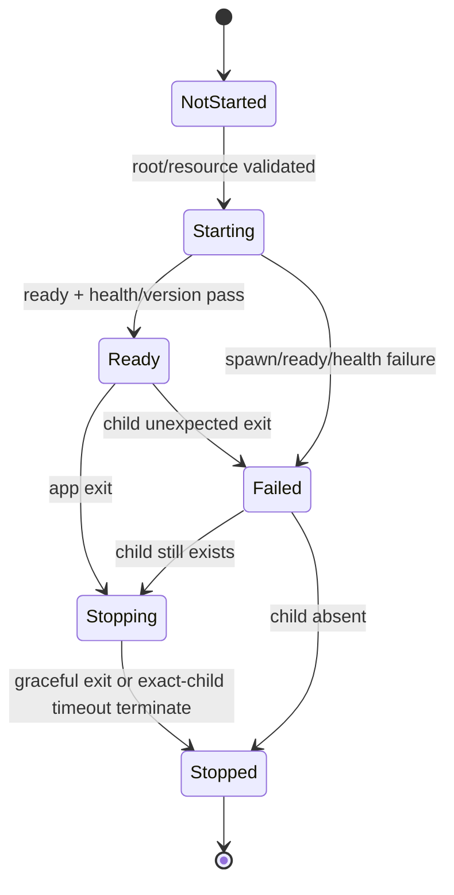

# P2.25 平台边界与 Sidecar 架构设计

## 1. 执行摘要

**结论：继续采用 Tauri 2 + React/Vite + FastAPI sidecar + SQLite。** 当前仓库已分别验证静态 Tauri 壳、独立 debug exe、PyInstaller onedir sidecar、token、ready、health、shutdown 与外部数据根的基础能力；不需要重写技术栈。

本阶段定稿：React 页面只依赖平台无关的 `LearningService`；Windows adapter 通过受限的 Tauri command 调用 Rust；Rust 持有 startup token、随机端口和精确 child handle，并以 HTTP 调用 FastAPI sidecar；完整 PyInstaller onedir 以 Tauri `bundle.resources` 携带。FastAPI HTTP 边界保留，但 React 不直连它。

P2.5 仅验证该链路，且只使用明确创建的临时数据根。P3 才实现数据目录选择、bootstrap 实际接入、用户数据库与显式迁移。NSIS、签名和 Android 不在本阶段实施。

## 2. 当前代码审计

### 已实现事实

- P2 根 `package.json` 使用本地 `@tauri-apps/cli` 2.11.4；`src-tauri` 使用 Tauri 2.11.5、`tauri-build` 2.6.3、Rust 2024。capability 只有 `core:default`，无 Shell、文件系统、HTTP 或进程插件。
- Tauri 开发地址为 `http://127.0.0.1:1420`。Vite 只绑定 loopback、启用 `strictPort`，开发期 `/api` proxy 仍指向 `127.0.0.1:8000`；生产静态资源为 `frontend/build-output`。
- `backend.desktop_sidecar` 强制 `desktop_production`、显式 user-data root、至少 32 字符 token、显式 ready file；预绑定 `127.0.0.1:0` socket，先准备 storage，再启动 Uvicorn。
- ready JSON 用临时文件和 `os.replace` 原子写入，只包含 status、PID、host/port、app/API/schema 版本及 run mode；不含 token 或数据库路径。
- `DesktopSecurityApp` 对包括 `/health` 在内的全部 HTTP 请求要求 `X-Local-English-Trainer-Token`，用 `hmac.compare_digest` 比较。`POST /desktop/shutdown` 只在 wrapper 中处理并设 `server.should_exit`；CORS 默认空 allowlist。
- 当前 spec 以 `EXE(... exclude_binaries=True)` 加 `COLLECT(...)` 生成名为 `local-english-trainer-api` 的 onedir bundle。构建脚本约定的 exe 为 `desktop-build/sidecar/local-english-trainer-api/local-english-trainer-api.exe`。
- `DesktopStorageLayout` 已能验证绝对、非仓库根并准备 `data/backups/imports/exports/logs/cache`；bootstrap 与只读迁移基础已存在，但没有接入 Tauri。

### 尚缺能力

- 没有 resource staging、sidecar launcher、ready/health Rust 校验、child supervision、退出清理或 Tauri command。
- `App.tsx` 直接导入 `api.ts` 函数；不存在 LearningService。
- 没有 Rust HTTP client、业务路径白名单、timeout/cancel 映射、production CSP 或 sidecar crash UI。
- 当前静态壳不读取 bootstrap，未接入用户数据目录或迁移。

## 3. 当前 API 调用盘点

### 前端 API：完整清单

`frontend/src/api.ts` 是唯一包含 `fetch` 的文件，共 **20 个业务调用**。没有 axios、`XMLHttpRequest`、Tauri `invoke`、`VITE_*` API base URL、硬编码 localhost/8000。它以 `requestJson` 直接 `fetch(path)`，统一 JSON Content-Type，并把非 2xx 转为 `ApiError(status, detail)`；目前没有 timeout 或 `AbortSignal`。

| 调用位置 | 页面/模块 | 方法 | 路径 | 请求 | 响应 | 当前错误处理 | fallback | transport 耦合 |
| --- | --- | --- | --- | --- | --- | --- | --- | --- |
| `validateReadingPack` | Import | POST | `/api/import/reading-pack/validate` | 任意 JSON | `ImportValidationResult` | `ApiError` | 显示校验错误 | 是 |
| `importReadingPack` | Import | POST | `/api/import/reading-pack` | 任意 JSON | `ReadingPackImportResponse` | `ApiError` | 无写入 fallback | 是 |
| `listReadingPacks` | 初始加载/Library | GET | `/api/reading-packs` | 无 | `ReadingPackSummary[]` | 上层 catch | 示例 pack | 是 |
| `getReadingPack` | Workspace/Library | GET | `/api/reading-packs/{pack_id}` | path id | `ReadingPack` | 上层 catch | 回到/保留示例 | 是 |
| `submitPracticeAttempt` | Workspace | POST | `/api/practice-attempts` | `{pack_id,answers}` | `PracticeAttemptDetail` | 上层 catch | 仅提示不可提交 | 是 |
| `listPracticeAttempts` | Dashboard | GET | `/api/practice-attempts` | 无 | `PracticeAttemptSummary[]` | 上层 catch | 空列表/notice | 是 |
| `getPracticeAttempt` | Dashboard | GET | `/api/practice-attempts/{attempt_id}` | path id | `PracticeAttemptDetail` | 上层 catch | 清空详情 | 是 |
| `listAnnotations` | Workspace | GET | `/api/annotations?pack_id=` | query id | `ReadingAnnotation[]` | 上层 catch | 空标注/notice | 是 |
| `createAnnotation` | Workspace | POST | `/api/annotations` | `AnnotationCreate` | `AnnotationCreateResult` | `ApiError.message` | 示例状态阻止写入 | 是 |
| `deleteAnnotation` | Workspace | DELETE | `/api/annotations/{annotation_id}` | path id | `AnnotationDeleteResponse` | 上层 catch | 不可用提示 | 是 |
| `createVocabularyItem` | Workspace | POST | `/api/vocabulary` | `VocabularyItemCreate` | `VocabularyItem` | `ApiError.message` | 示例状态阻止写入 | 是 |
| `listVocabularyItems` | Library | GET | `/api/vocabulary` | 无 | `VocabularyItem[]` | 上层 catch | 空列表/notice | 是 |
| `getVocabularyItem` | Library | GET | `/api/vocabulary/{vocab_id}` | path id | `VocabularyItem` | 上层 catch | 可保留 cached item | 是 |
| `updateVocabularyItem` | Library | PATCH | `/api/vocabulary/{vocab_id}` | update DTO | `VocabularyItem` | 上层 catch | 无写入 fallback | 是 |
| `deleteVocabularyItem` | Library | DELETE | `/api/vocabulary/{vocab_id}` | path id | delete DTO | 上层 catch | 无写入 fallback | 是 |
| `listSentenceItems` | Library | GET | `/api/sentences` | 无 | `SentenceItem[]` | 上层 catch | 空列表/notice | 是 |
| `getSentenceItem` | Library | GET | `/api/sentences/{sentence_id}` | path id | `SentenceItem` | 上层 catch | 可保留 cached item | 是 |
| `createSentenceItem` | Workspace | POST | `/api/sentences` | `SentenceItemCreate` | `SentenceItem` | `ApiError.message` | 示例状态阻止写入 | 是 |
| `updateSentenceItem` | Library | PATCH | `/api/sentences/{sentence_id}` | update DTO | `SentenceItem` | 上层 catch | 无写入 fallback | 是 |
| `deleteSentenceItem` | Library | DELETE | `/api/sentences/{sentence_id}` | path id | delete DTO | 上层 catch | 无写入 fallback | 是 |

| 类别 | 当前文件 | 设计结论 |
| --- | --- | --- |
| 纯 UI/选区 | `InlineAnnotatedParagraph.tsx`、`annotationText.ts`、`annotationColors.ts` | 保持平台无关。 |
| 页面状态 | `App.tsx` | 保持 React state，但改依赖 service，不能知道 transport。 |
| transport | `api.ts` | 当前唯一 HTTP 耦合点；演化为 Web adapter 的过渡 facade。 |
| 类型 | `types.ts` | 当前混合 DTO/UI type；初期复用，后续抽出 domain types。 |
| mock/fallback | `mockData.ts`、`App.tsx` | 保持 mock 数据，改由 MockLearningService 提供。 |
| 浏览器偏好 | annotation colors 的 `localStorage` | 可保留；学习数据不得写 localStorage。 |

### 后端 API：完整契约

`backend/app/main.py` 有 20 个业务端点。Pydantic 输入/输出模型在 `schemas.py`；常见业务错误为 400 validation、404 not found、409 duplicate/conflict，FastAPI schema validation 还可能返回 422。

| 方法 | 路径 | 请求结构 | 响应结构 | 错误状态 | 分类 |
| --- | --- | --- | --- | --- | --- |
| GET | `/health` | 无 | `HealthResponse(status, app_version, api_protocol_version, schema_version, run_mode)` | 401（desktop wrapper 无 token） | 生命周期，非 React |
| POST | `/api/import/reading-pack/validate` | JSON dict | `ImportValidationResult` | 200（valid 可为 false） | 业务 |
| POST | `/api/import/reading-pack` | JSON dict | `ReadingPackImportResponse` | 400、409、422 | 业务 |
| GET | `/api/reading-packs` | 无 | `ReadingPackSummary[]` | 200 | 业务 |
| GET | `/api/reading-packs/{pack_id}` | path id | `ReadingPackDetail` | 404 | 业务 |
| POST | `/api/practice-attempts` | `PracticeAttemptCreate` | `PracticeAttemptDetail` | 400、404、422 | 业务 |
| GET | `/api/practice-attempts` | 无 | `PracticeAttemptSummary[]` | 200 | 业务 |
| GET | `/api/practice-attempts/{attempt_id}` | path id | `PracticeAttemptDetail` | 404 | 业务 |
| POST | `/api/annotations` | `AnnotationCreate` | `AnnotationCreateResult` | 400、404、409、422 | 业务 |
| GET | `/api/annotations?pack_id=` | pack query | `AnnotationOut[]` | 404、422 | 业务 |
| DELETE | `/api/annotations/{annotation_id}` | path id | `AnnotationDeleteResponse` | 404 | 业务 |
| POST | `/api/vocabulary` | `VocabularyItemCreate` | `VocabularyItemOut` | 400、409、422 | 业务 |
| GET | `/api/vocabulary` | 无 | `VocabularyItemOut[]` | 200 | 业务 |
| GET | `/api/vocabulary/{vocab_id}` | path id | `VocabularyItemOut` | 404 | 业务 |
| PATCH | `/api/vocabulary/{vocab_id}` | `VocabularyItemUpdate` | `VocabularyItemOut` | 400、404、422 | 业务 |
| DELETE | `/api/vocabulary/{vocab_id}` | path id | `VocabularyDeleteResponse` | 404 | 业务 |
| POST | `/api/sentences` | `SentenceItemCreate` | `SentenceItemOut` | 400、409、422 | 业务 |
| GET | `/api/sentences` | 无 | `SentenceItemOut[]` | 200 | 业务 |
| GET | `/api/sentences/{sentence_id}` | path id | `SentenceItemOut` | 404 | 业务 |
| PATCH | `/api/sentences/{sentence_id}` | `SentenceItemUpdate` | `SentenceItemOut` | 400、404、422 | 业务 |
| DELETE | `/api/sentences/{sentence_id}` | path id | `SentenceDeleteResponse` | 404 | 业务 |
| POST | `/desktop/shutdown` | 无 | `{status:"shutting_down"}` | 401（无效 token） | 生命周期，非 React |

跨平台业务能力是全部 `/api/*`。`/health`、`/desktop/shutdown`、ready、startup token、port、CORS、sidecar CLI 与数据根只属于 Windows lifecycle，不向 React 暴露；Android 需要实现业务能力对应的 native adapter，而不是复用 FastAPI/Python 进程。

## 4. 目标总体架构



Windows 正式选择：**React → Tauri invoke → Rust 内部 HTTP client → FastAPI sidecar**。FastAPI HTTP 边界仍然保留；WebView 不获得端口或 token。Web 开发使用 HTTP adapter + Vite same-origin proxy；未来 Android 替换 adapter 和 native storage。

## 5. LearningService 边界

选择 **LearningService 接口 + Web HTTP adapter + Windows Tauri adapter**。不选页面继续 fetch、单纯 HTTP client、页面直接 command adapter 或页面直接 `invoke`。

`LearningService` 表达 reading pack、attempt、annotation、vocabulary、sentence 的业务操作；不得出现 URL、header、端口、token、Tauri command、PyInstaller 路径或 SQLite 路径。

建议未来目录（本轮不创建）：

```text
frontend/src/
  domain/learning.ts
  services/LearningService.ts
  platform/selectLearningService.ts
  adapters/web/HttpLearningService.ts
  adapters/tauri/TauriLearningService.ts
  adapters/mock/MockLearningService.ts
  api.ts                         # 过渡 facade，随后删除或兼容导出
```

- 方法接受 `RequestOptions { signal?: AbortSignal }`。Web adapter 传给 fetch；Tauri adapter 使用 request id，abort 时取消精确 Rust future，并返回 `LearningError(kind: "canceled")`。
- 统一错误为 `unavailable`、`timeout`、`canceled`、`validation`、`conflict`、`not_found`、`version_mismatch`、`unexpected`。页面只按 kind 与安全 message 显示 UI。
- ready 15 秒、health 5 秒、普通业务 10 秒；导入可为 30 秒。proxy body 上限 4 MiB，JSON response 上限 8 MiB，超限不转发。
- P2.5 必须校验 ready 和 token 化 health 的 app/API/schema 版本。当前 protocol/schema 均为 `1`；不匹配进入 `version_mismatch`，禁止业务请求。
- `FakeLearningService`/`MockLearningService` 是组件测试替身；组件测试不 mock fetch、Tauri 或 token。

禁止：页面直接 `fetch("/api/...")`、直接 invoke、引用 Tauri API、Windows 绝对路径、token、随机端口和进程控制。Android 只替换底层 adapter，不重写页面。

## 6. Windows Tauri 通信模型

| 项目 | 直连 localhost | invoke → Rust proxy → sidecar |
| --- | --- | --- |
| token/随机端口 | 必须进入 JS | Rust 内存持有，JS 不可见 |
| CORS/CSP | WebView 要访问 loopback | CORS 可保持空 allowlist；WebView 不连 sidecar |
| localhost 攻击面 | XSS 更易窃取 token | 端口可被探测但 token 不泄漏 |
| Android | 页面假设 HTTP/端口 | adapter 可替换 native storage |
| 测试 | 浏览器/HTTP 耦合 | service fake、Rust proxy、sidecar 独立测试 |

选择右侧方案。Rust command 只接收闭合的业务 operation enum 和受大小限制 JSON，不接收任意 URL、header、token 或 method；只允许当前 20 个 `/api/*` 操作。`/health` 与 `/desktop/shutdown` 只给 lifecycle manager。

P2.5 应设置生产 CSP 为 `default-src 'self'; connect-src 'self'`，开发模式仅按 Tauri/Vite dev origin 加最小例外。继续保持最小 capability，不加入 Shell/FileSystem/HTTP/Process plugin。

## 7. PyInstaller onedir 打包

**定稿：不用 `externalBin`，以 `bundle.resources` 携带完整 onedir。**

Tauri 官方 sidecar 文档规定 `externalBin` 对每个 target 要有 `-$TARGET_TRIPLE` 后缀。当前 Windows triple 是 `x86_64-pc-windows-msvc`，若采用 externalBin 文件名将是 `local-english-trainer-api-x86_64-pc-windows-msvc.exe`。当前 spec 是 `COLLECT` onedir，exe 依赖同目录依赖（PyInstaller 6 常见 `_internal`）；只复制 exe 会破坏 bundle。

Tauri resources 官方文档支持递归复制目录、保留结构并通过 `resource_dir` 定位。目标结构：

```text
$RESOURCE/
  sidecar/
    local-english-trainer-api/
      local-english-trainer-api.exe
      _internal/ ...                 # COLLECT 的全部同级内容
```

- source 是完整 `desktop-build/sidecar/local-english-trainer-api/`，不是单独 exe。
- 开发模式只接受 P2.5-A 显式构建/标记的项目 staging root，不自动搜索磁盘。
- debug/release/安装后由 Rust `app.path().resource_dir()` 加 `sidecar/local-english-trainer-api` 定位。P2.5-A 必须实测 debug `--no-bundle` 路径，不能假定其与安装后相同。
- exe 名称固定 `local-english-trainer-api.exe`；target triple 只记录 externalBin 未采用的命名规则。
- `Command::current_dir` 设为 onedir 根。安装/resource 目录按只读处理；SQLite、ready、logs、临时文件只写显式 user-data/test root。

## 8. Sidecar 生命周期状态机



| 状态 | 允许操作 | 转换条件 |
| --- | --- | --- |
| `NotStarted` | 解析资源/根，生成 token | 前置通过后 `Starting` |
| `Starting` | spawn 精确 exe，限额捕获 stdout/stderr，等待 ready/health | 双校验通过为 `Ready`；任一失败为 `Failed` |
| `Ready` | 受控业务 proxy，观察 child | 退出到 `Stopping`；意外退出到 `Failed` |
| `Stopping` | 一次 token shutdown、等待 | 退出为 `Stopped`；超时仅终止保存 child 后 `Stopped` |
| `Failed` | 显示无敏感错误，阻止业务 | child 尚在则 `Stopping`，否则 `Stopped` |
| `Stopped` | 清除内存 token/endpoint | 用户明确重试可重新 `Starting` |

| 能力 | 当前状态 | P2.5 | P3/P4 |
| --- | --- | --- | --- |
| 随机 loopback/ready/version | Python 已实现 | Rust 校验 | 无 |
| token/health/shutdown | Python 已实现 | Rust 调用/timeout | 无 |
| storage root 验证 | 已实现 | 只传临时根 | P3 接入用户根/bootstrap |
| child handle、stderr 限额、超时 | 缺失 | 实现 | 无 |
| typed proxy | 缺失 | 实现 | 无 |
| orphan/第二实例 | 缺失 | 只清理精确 child；测试根独立 | P3 在真实数据前定稿单实例策略 |
| 强制关闭/重启 | OS 可终止 | 不承诺 graceful | P3 恢复 UX |

P2.5 不 broad-kill Python、同名 exe 或按端口枚举进程；只操作本次 `Command::spawn` child。ready/health timeout、端口失败和 token 错误都先清理该 child。stdout/stderr 用固定大小环形缓冲，日志和 UI 不含 token。

## 9. 安全模型

- sidecar 固定 `127.0.0.1`，使用已实现的 port `0` 随机预绑定；不加 Windows 防火墙入站规则。
- Rust 用 CSPRNG 生成 token，只以 child environment 传递，仅存活于本次 app 内存；不写 ready、bootstrap、日志、command response 或 JavaScript。
- 保持 `X-Local-English-Trainer-Token`；health/shutdown 都要求 token，React 不可调用。
- ready 校验 status、child PID、`127.0.0.1`、有效 port、`desktop_production` 和三项版本；敏感字段出现即作为协议违规失败。
- proxy 只放行 20 个业务 operation；body 4 MiB、response 8 MiB、普通 10 秒/导入 30 秒。日志只记 operation/status/trace id，不记正文、token、数据库路径或完整 ready 内容。
- sidecar CORS 维持空 allowlist；Web adapter 在开发期走 Vite 同源 proxy。生产 CSP 与 capability 保持最小。
- token 可阻止普通 localhost 探测者调用 API，但不把同一用户权限的恶意进程视为可信边界；仍依赖 Windows 用户会话与恶意软件防护。

## 10. 数据目录与 P3 边界

P2.5 测试只使用 `%TEMP%/local-english-trainer-p2_5-<uuid>/user-data` 一类的明确临时根，显式传入 sidecar。不得读取原始仓库、开发库或用户数据库；只删除本轮创建且绝对根已记录的临时目录。

P3 才实现首次启动目录选择、bootstrap 指针、用户库创建、显式迁移、只读源库、完整性检查、backup、临时目标验证、原子替换、已有目标拒绝覆盖和取消 UX。现有 storage/migration 函数是 P3 基础，不授权 P2.5 访问真实数据。

## 11. Android 兼容性

```text
Windows: React → LearningService → Tauri adapter → Rust proxy → FastAPI sidecar → SQLite
Android: React → LearningService → Android adapter → Rust/Kotlin/native storage → Android SQLite
```

React 页面、UI 状态、选区/annotation 规则、mock、LearningService domain types 与 reading pack 数据格式可以复用。FastAPI/PyInstaller/Uvicorn、Windows process lifecycle、loopback token、NSIS、Windows 路径不能复用。Android 不启动 Python、不需要本地 HTTP；只实现 native adapter。该边界不会显著增加当前 Windows 工作量，因为 fetch 已集中于 `api.ts`；现在不安装 Android 工具链、不设计 native storage。

## 12. 构建与安装包链路

| 顺序 | 产物/检查 | Git | 归属 |
| --- | --- | --- | --- |
| 1 | `sync_version.py --check` | `version.json`/源常量 | 开发机 |
| 2 | 前端 build | `frontend/build-output` 忽略 | Tauri 输入 |
| 3 | CPython/lock 检查 | lock 提交 | 开发机 |
| 4 | PyInstaller onedir | `desktop-build` 忽略 | resource 输入 |
| 5 | temporary-root sidecar smoke | 否 | 开发机/CI |
| 6 | 完整 onedir resource staging | stage 忽略 | Tauri bundle |
| 7 | Cargo/Tauri build | `Cargo.lock` 提交，target 忽略 | app/resources |
| 8 | NSIS | 产物忽略 | 未来 setup.exe |
| 9–11 | 安装、升级、卸载保留数据 smoke | 否 | 发布验证 |
| 12 | 签名 | 证书/产物否 | 发布 |

`version.json` 继续是 app/API/schema 权威来源。最终 setup.exe 携带 React 与完整 sidecar；用户不需要 Python、Node、Rust、Build Tools 或 PyInstaller。安装目录只存代码/resources；数据与日志在 P3 的 user-data root，升级/卸载默认不删。

## 13. P2.5 分步实施计划

| 步骤 | 目标与精确文件 | 测试与安全边界 | 完成条件/人工确认 |
| --- | --- | --- | --- |
| A resource staging spike | 新增 `scripts/stage-sidecar-resource.ps1`；修改 `src-tauri/tauri.conf.json`、`.gitignore`；新增 staging 测试 | 只用 fixture/临时目录 | debug no-bundle `resource_dir` 找到完整 onedir；人工核对目录 |
| B lifecycle manager | 修改 `src-tauri/Cargo.toml`、`src-tauri/src/main.rs`；新增 `src-tauri/src/sidecar.rs`、`sidecar_protocol.rs` | fake child/ready fixture，不用真实根 | token/port/child 仅 Rust state，双握手后 Ready |
| C shutdown/crash | 修改 `src-tauri/src/sidecar.rs`；新增 lifecycle tests；仅在协议缺口时改 `backend/desktop_sidecar.py`/tests | 不 broad-kill，临时根 | 正常/超时/意外退出均无 child；人工关闭窗口 |
| D typed proxy | 修改 `main.rs`；新增 `learning_proxy.rs`/tests；必要时 capability | allowlist/size/timeout/no-secret tests | 任意 URL/header/health/shutdown 不可从 React 调用 |
| E LearningService | 新增 `services/LearningService.ts`、platform、web/tauri/mock adapters；修改 `api.ts`、`App.tsx` 仅换依赖 | adapter contract/component tests | 页面无直接 fetch/invoke，fallback 行为保持 |
| F debug 闭环 | 新增 `scripts/smoke-test-tauri-sidecar.ps1`，补测试/文档 | 仅本轮 temp root | exe→ready→health→最小业务→关闭均通过；真实交互会话确认 |

## 14. 测试矩阵

| 层级 | 关键案例 |
| --- | --- |
| Frontend service | Web/Tauri/mock 等价、AbortSignal、timeout、错误映射、无 transport 泄漏 |
| Rust lifecycle | resource path、spawn env、ready/version、health timeout、精确 child terminate、stderr redaction |
| Rust proxy | operation/method allowlist、body/response limit、无 token/URL/header 回传、取消 |
| Sidecar | 既有 token/loopback/ready/shutdown/CORS tests 继续通过 |
| Integrated | 临时根、随机端口、无 repository DB、正常 shutdown、意外退出 |
| Packaging | 完整 onedir、debug/installed resource path、无安装目录写入 |
| Release/P3 | setup/升级/卸载保留数据/签名；非 P2.5 |

## 15. 风险与缓解

| 类别 | 风险 | 缓解 |
| --- | --- | --- |
| 架构 | 页面继续依赖 HTTP | P2.5-E 迁移为 LearningService facade |
| 架构 | token/port 泄漏 | 仅 Rust state，typed command 无 endpoint/token 参数 |
| 实现 | 仅复制 exe 使 `_internal` 缺失 | resources 递归完整目录，P2.5-A 实测 |
| 实现 | 陈旧/伪造 ready | PID/host/port/mode/version 全校验，失败清理 child |
| 实现 | child 残留 | 保存 Child，超时只终止该 handle |
| 发布 | 安装目录权限/杀毒 | sidecar 不写安装目录；签名/install smoke 留给 release |
| 发布 | 卸载误删数据 | P3/release 数据与安装目录分离 |
| Android | Windows API 进入 React | LearningService + adapter，禁止 invoke/paths 进入组件 |

## 16. 架构决策表

| 决策 | 最终选择 | 原因 | 何时可重新评估 |
| --- | --- | --- | --- |
| React 直接 fetch | 否 | 脱离 transport/platform | 不重新开放；仅 adapter 可 fetch |
| React 直接 invoke | 否 | 不泄漏 command/Windows | 不重新开放；仅 adapter invoke |
| LearningService | 是 | 页面、Android、测试共同边界 | 接口粒度可演进 |
| token 进入 JS | 否 | 降低 XSS/localhost 风险 | 不重新评估 |
| Rust proxy | 是，typed allowlist | Rust 持 endpoint/token/child | command 粒度可调 |
| FastAPI HTTP | 保留 | 复用业务 API/测试 | 不因 Android 重写 |
| externalBin | 否 | 当前 onedir 非单 exe | 仅变单 exe 再评估 |
| resources | 是，完整 onedir | 官方支持递归目录与 resource_dir | staging layout 可调 |
| onedir | 整目录复制 | 同级依赖不可丢 | 不重新评估 |
| 启停/child/port/token | Rust lifecycle manager | 精确 process 与最小暴露 | 不下放给 React |
| P2.5 数据 | 仅临时根 | 阻断真实数据风险 | P3 明确批准后 |
| Android Python sidecar | 否 | native adapter/storage | 不重新评估 |
| Windows setup.exe | 是，未来 NSIS | Tauri resources 可进入 bundle | release 验证 |

**锁定决策：** LearningService、Rust proxy、token/port/child 仅 Rust 持有、FastAPI HTTP 保留、resources 完整 onedir、P2.5 不用真实数据。

**仍可调整：** service 文件名、command 粒度、timeout 常量、staging 目录、trace id、P3 单实例 UX；不得将 token/端口放回 JS，也不得把 onedir 缩为单 exe。

## 17. 不在本阶段实施的内容

不创建 P2.5 源码/配置/依赖/staging 脚本/测试；不接入用户数据目录、bootstrap、真实 SQLite、迁移、NSIS/MSI、签名、updater、Tauri 高权限插件或 Android 工具链/应用。

## 18. 最终 Go / No-Go 结论

**GO，进入 P2.5-A resource staging 技术 spike。** 架构能支持未来单一 Windows setup.exe：Tauri bundle 携带 React 和完整 PyInstaller onedir；最终用户无需开发工具或 Python。FastAPI HTTP 保留，LearningService 为 Android 留出替换 adapter 的边界。

没有需要推翻架构的 P2.5 阻塞项。唯一实施门槛是先实测完整 onedir 的 debug/installed resource 路径，并且所有 P2.5 smoke 只使用可识别临时数据根。不要提前接入 bootstrap、真实数据库、安装器或 Android。

## 19. 官方参考资料

- [Tauri 2 — Embedding External Binaries](https://v2.tauri.app/develop/sidecar/)：`externalBin` 与 target-triple 文件名。
- [Tauri 2 — Embedding Additional Files](https://v2.tauri.app/develop/resources/)：递归 resources、目录映射与 `resource_dir`。
- [Tauri 2.11.5 PathResolver](https://docs.rs/tauri/2.11.5/tauri/path/struct.PathResolver.html)：Rust runtime resource directory API。
- [PyInstaller 6.21 — Operating Mode](https://pyinstaller.org/en/stable/operating-mode.html)：onedir 携带解释器/依赖，最终用户无需 Python。
- [PyInstaller 6.21 — Spec Files](https://pyinstaller.org/en/stable/spec-files.html)：spec 与 `COLLECT` 分发内容。
- [Rust std::process::Command](https://doc.rust-lang.org/std/process/struct.Command.html)：显式 program/environment/current_dir 与 child handle。